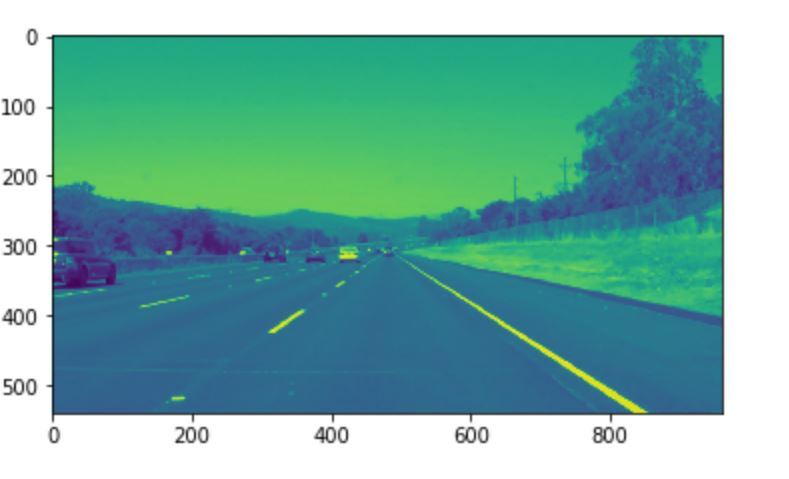
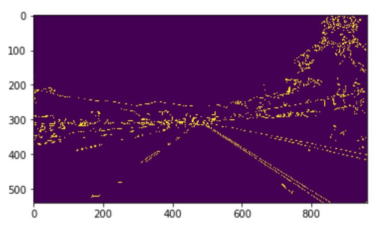
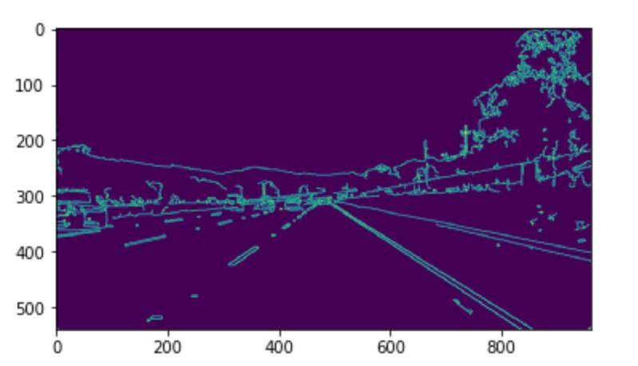
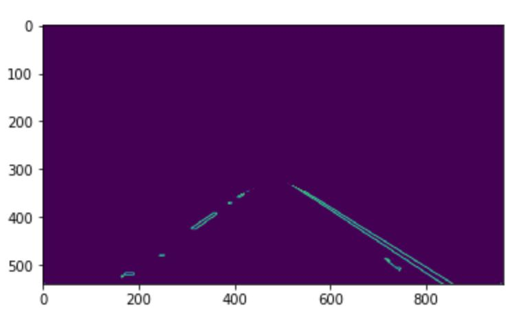
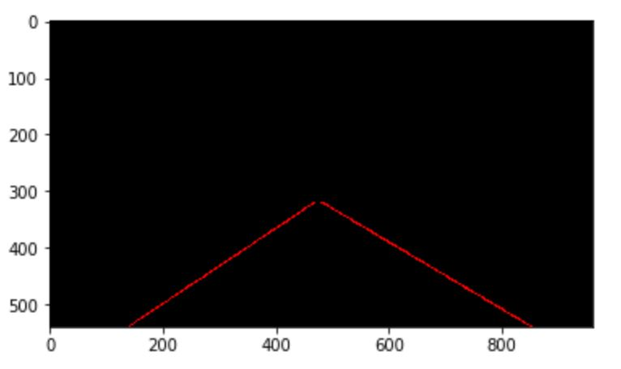
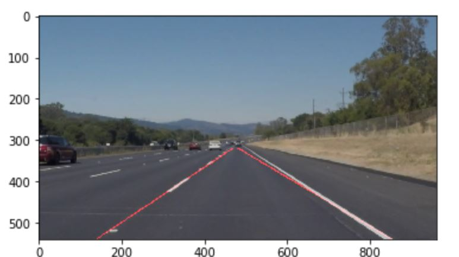

# **Finding Lane Lines on the Road** 

In this project, I have used computer vision Open CV to identify lane lines on the road, first in an image, and later in a video stream.

The goal in this project is to write code including a series of steps (pipeline) that identify and draw the lane lines on a few test images. Once we have successfully identified the lines in an image, we use that pipeline to execute the code in a series of images resulting in a video.

### Reflection

### 1. Describe your pipeline. As part of the description, explain how you modified the draw_lines() function.

The pipelines which I used consits of the below steps in order. 
    
   
#### Step 1:

Reading of the 'test_images/solidWhiteRight.jpg' on which the pipeline would be tested. 

Applying gray scale image to the original image using cvtColor() function of opencv.

#### Step 2:

Once the gray scale is applied we used that image to identify canny edges using the opencv.

I have defined the lower and upper threshold as 50 and 150 for the canny finction respectively.

Below is the result of the canny edges :

#### Step 3:

Next step in pipeline i applied the gaussian blur to smooth the canny edge image. Again we used opencv for this.

kernel size of 3 was provided to the opencv GaussianBlur() function.

Below is the outcome of the gaussian blur image :

#### Step 4:

In this step we defined the region of intrest for the canny edge image. Basically we are trying to identify the parallel lines corresponding to the path that the veichle is following. 

Below are the vertices used for the opencc fillpolly() mentiod . 

vertices = np.array([[(0,blur_gray.shape[0]),(485, 320), (490, 320), (blur_gray.shape[1],blur_gray.shape[0])]], dtype=np.int32)

Below is the outcome of the region of intrest function  :

#### Step 5:

In this step of the pipeline we use opencv HoughLinesP() method to identy the lines in the image . 

Below is the parameters values identified for the HoughLinesP funtion.

 rho = 2 - distance resolution in pixels of the Hough grid
 theta = np.pi/180 - angular resolution in radians of the Hough grid
 threshold = 15     - minimum number of votes (intersections in Hough grid cell)
 min_line_length = 40 - minimum number of pixels making up a line
 max_line_gap = 20    - maximum gap in pixels between connectable line segments
 
 In this step have updated the draw_lines() method to create a straigh line across the lane identified from the HoughLinesP finction.

Outcome of the HoughLinesP and draw_line mentiods :

#### Step 6:

In this step we finally append the hough lines to the orginal image to give a lines on top of image kind of feel. 

Outcome of the final processed image of the pipeline :

### 2. Identify potential shortcomings with your current pipeline

One pottential shortcomings which i see that the lines identifed are not always symmetrical to the lane marking for few frames.

### 3. Suggest possible improvements to your pipeline

Have a smooth transistion of the lane markings from hough lines from one frame to another in the video.
